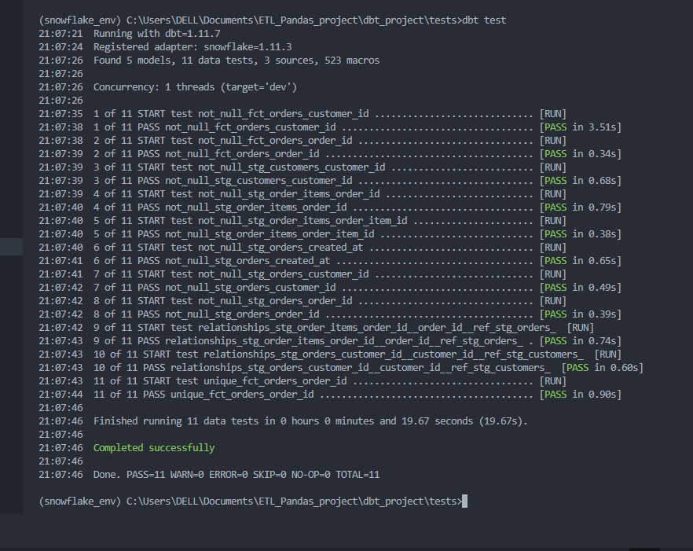
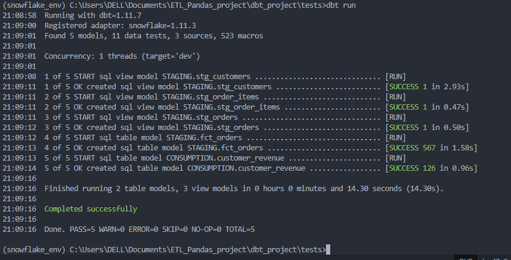
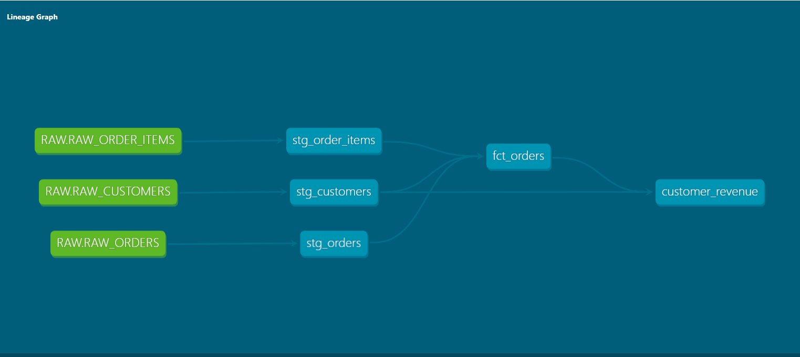

# Kartify ELT Analytics Pipeline : From Transactional Data to Analytics with python, dbt & Snowflake
End-to-end ELT pipeline for Kartify e-commerce data using Python, dbt, and Snowflake, with structured data modeling, testing, and analytics-ready outputs.

## Project Objective
The objective of this project is to design and implement an end-to-end ELT pipeline that transforms raw transactional data from the Kartify e-commerce application into clean, reliable, and analytics-ready data models.

The pipeline extracts data from a PostgreSQL database, performs initial transformations using Python (Pandas), and loads the data into Snowflake. Using dbt, the data is further transformed into structured layers (staging, intermediate, and mart) to support scalable analytics and reporting.

This project aims to enable data-driven decision-making by providing high-quality datasets for analyzing customer behavior, revenue performance, and transaction trends, while ensuring data integrity through testing and documentation.

## Architecture Diagram


## Project Stack
  - python (Pandas, SQLAlchemy) : Ingestion tool from Postgres transactional DB to snowflake warehouse layer
  - postgresql : Transactioanl Database 
  - snowflaken : cloud datawarehouse
  - dbt core : building tool for transformation, testing and documentation
  - github : version control

## Data Pipeline Flow


1. Extract
  - Data is extracted from a PostgreSQL database powering the Kartify application.
2. Load
  - Cleaned data is loaded into Snowflake as the central data warehouse.
3. Transform (dbt)
  - Data is transformed into structured models using dbt:
    - Staging Layer: Cleans and standardizes raw data
    - Intermediate Layer: Applies transformation logic
    - Mart Layer: Produces business-ready datasets

## dbt Data Modeling

The dbt project follows a layered architecture:

1. ```staging/``` → Raw data cleaned and standardized
2. ```intermediate/``` → Transformation logic applied
3. ```mart/``` → Business-level models for reporting
   
Example Mart Model: Customer Revenue

This model aggregates transactional data to provide insights into customer value:

1. Total revenue per customer
2. Total number of orders per customer

This supports key business questions such as:

1. Who are the highest-value customers?
2. How active are customers in terms of order frequency?

## Data Quality Testing

Data quality is enforced using dbt tests:

not_null → Ensures critical fields are not empty

unique → Validates primary keys

relationships → Ensures referential integrity

Test Results



**dbt run output**
The dbt run command successfully materialized all models across staging, intermediate, and mart layers.

Run result



## dbt Documentation

dbt documentation provides:

1. Data lineage (DAG)
2. Model dependencies
3. Column-level descriptions (data dictionary)

Data Lineage (DAG)



## customer_revenue

| Column Name     | Description                              |
|----------------|------------------------------------------|
| customer_id    | Unique identifier for each customer      |
| customer_name  | Full name of the customer                |
| total_revenue  | Total revenue generated by the customer  |


1. DAG (VERY IMPORTANT)

This shows your pipeline flow:

staging → intermediate → mart
2. Model Details Page

Shows:

Column descriptions
Tests
SQL logic

docs/dbt_dag.png
docs/dbt_model_details.png


    


