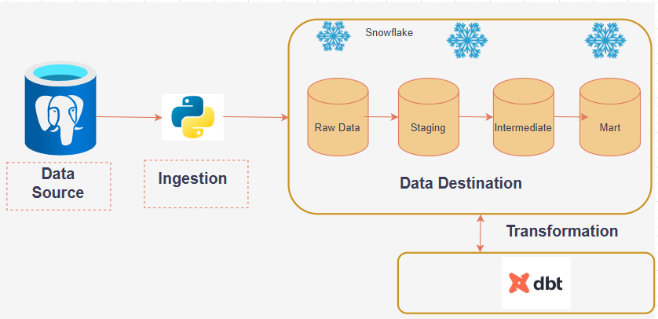

# Kartify ELT Analytics Pipeline : From Transactional Data to Analytics with dbt & Snowflake
End-to-end ELT pipeline for Kartify e-commerce data using Python, dbt, and Snowflake, with structured data modeling, testing, and analytics-ready outputs.

## Architecture Diagram

## Project Stack
  - python (Pandas, SQLAlchemy) : Ingestion tool from Postgres transactional DB to snowflake warehouse layer
  - postgresql : Transactioanl Database 
  - snowflaken : cloud datawarehouse
  - dbt core : building tool for transformation, testing and documentation
  - github : version control

## Project Objective
The objective of this project is to design and implement an end-to-end ELT pipeline that transforms raw transactional data from the Kartify e-commerce application into clean, reliable, and analytics-ready data models.

The pipeline extracts data from a PostgreSQL database, performs initial transformations using Python (Pandas), and loads the data into Snowflake. Using dbt, the data is further transformed into structured layers (staging, intermediate, and mart) to support scalable analytics and reporting.

This project aims to enable data-driven decision-making by providing high-quality datasets for analyzing customer behavior, revenue performance, and transaction trends, while ensuring data integrity through testing and documentation.
